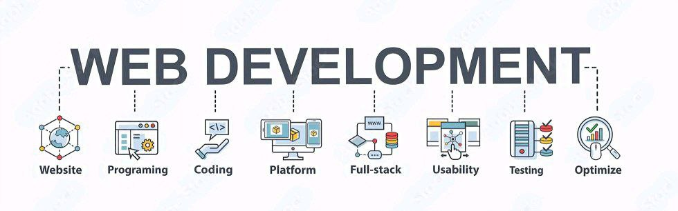

<!-- Banner -->
<picture>
  <!-- dark theme -->
  <source media="(prefers-color-scheme: dark)" srcset="https://raw.githubusercontent.com/shravanbhati/shravanbhati/main/dev.shravanbhati.webp">
  <!-- light theme -->
  <source media="(prefers-color-scheme: light)" srcset="https://raw.githubusercontent.com/shravanbhati/shravanbhati/main/dev.shravanbhati.webp">
  
</picture>

<h1 align="center">Hi, 👋 I'm Shravan Bhati</h1>
<h3 align="center">Front-End Web Developer</h3>

I'm a web developer, and currently working on three projects: YukiNihongo, Study in Japan, and MEXT Aspirant. YukiNihongo helps students to learn Japanese, Study in Japan provide helpful information on studying in Japan, and through MEXT Aspirant, I assist over 2.5k students with the MEXT Scholarship application process, providing resources and support.

 **Languages**
 
 |||
 |--|--|--|--|
 
 **Tools and Technologies**
 

|||
|--|--|--|--|

 
  Total Visitors

 
  

&nbsp;&nbsp;
&nbsp;&nbsp;
&nbsp;&nbsp;
&nbsp;&nbsp;
&nbsp;&nbsp;

  

<table><tr><td valign="top" width="41%">

</td><td valign="top" width="40%">

</td><td valign="top" width="18%">

</td></tr></table>

  

<!-- Github Stats -->

## Github stats 📊📈
<!-- Dark Mode -->

<!-- Light Mode -->

<!-- Most used languages -->
<!-- Dark Mode -->

<!-- Light Mode -->

<!-- Github streak -->
<picture>
  <!-- Dark Mode -->
  <source
    srcset="https://streak-stats.demolab.com?user=shravanbhati&theme=radical&card_width=804&hide_border=true"
    media="(prefers-color-scheme: dark)"
  />
  <!-- Light Mode -->
  <source
    srcset="https://streak-stats.demolab.com?user=shravanbhati&theme=shadow_green&card_width=804"
    media="(prefers-color-scheme: light), (prefers-color-scheme: no-preference)"
  />
  
</picture>

<!-- Activity Graph -->
<!-- Dark Mode -->

<!-- Light Mode -->

  

